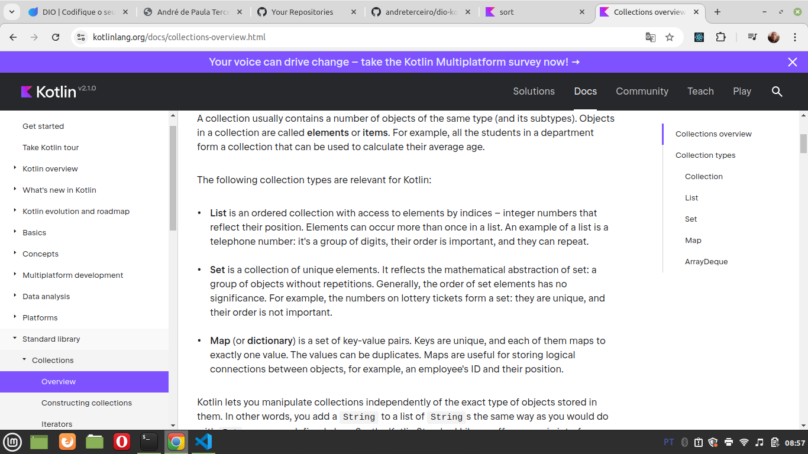

# General


## When statement


### When as a statement

Is simpe, see this code and you will understand

```kotlin
package tests

fun main() {
    val feedback = 4;
    when (feedback) {    
        1 -> println("Sorry. How can we improve?")
        2 -> println("ok. How can we improve?")
        3 -> println("Thanks!")
        else -> println("I do not know this rate")
    }
}
```

### When as an expression

Easy to understand because the syntax is similar as "when" as expression. But an attribuition is done in this case, see:

```kotlin
package tests

fun main() {
    val feedback = 1;
    var result: Any = when (feedback) {    
        1 -> "Sorry. How can we improve?"
        2 -> "ok. How can we improve?"
        3 -> "Thanks!"
        else -> "I do not know this rate"
    }

    print(result)
}
```


## Verifying types - is

```kotlin
package tests

fun main() {
    if ("hi" is String) {
        print ("hi is a string")
    } else {
        print ("hi is not a string")
    }
}
```

## Any - any type

[Please see here](https://pl.kotl.in/gM0GHOkMQ"). Easy to understand. any = any type


## for loop

Very simple. Please see [this code](https://pl.kotl.in/qylf7Yhi6).

In this section you all saw **string interpolation**, that is mixing a string with a variable.

You also saw another example of use of **"vararg**" in the internal function **listOf()**.

And you saw a example of "**any**", as you have more tham 1 type inside the list generated with **listof()**.


## while and do while

As **for loop** the behaviour and syntax is the same of the behaviour and syntax in some other programming languages and it is obvious, I will not reproduce here to save time.


## Operator function iterator

Please see [this code](https://pl.kotl.in/1RTRsNJzf) in Kotlin Playground.

Is the same as this code:
```kotlin
package tests

class Animal(val type: String) {
    override fun toString(): String {
        return type
    }
}

class Zoo(val animals: List<Animal>) {
    operator fun iterator(): Iterator<Animal> {
        return animals.iterator()
    }
}

fun main() {
    val animals = listOf(Animal("Lion"), Animal("Tiger"))
    val zoo = Zoo(animals)

    for (animal in zoo) {
        println("$animal")
    }
}
```

In the code above you can see an special function, an operator function named "iterator". When we create this operator function in a class, this function needs to return an iterator. And this way we can use the class in a for loop, iterating it. See in the final of the code that we are iteration zoo.

You also can see in the beginning of the code the keyword **"override"**, that we can use to override a function. In this case we are overriding the function **"toString()"**.


## Ranges

Please see [this code](https://pl.kotl.in/iIN8ocYRY) in Kotlin Playground.

Is the same as this code:

```kotlin
package tests

fun main() {
    for (i in 1..3) {
        println(i)
    }
    println("----------")
    
    for (i in 1 until 3) {
        println(i)
    }
    println("----------")    

    for (i in 1..10 step 2) {
        println(i)
    }
    println("----------")     

    for (i in 3 downTo 1) {
        println(i)
    }
    println("----------")
    
    for (i in 'a'..'z' step 5) {
        println(i)
    }
    println("----------")        
    
    var a = "a"

    if (a !in "b".."z") {
        println("a is not in the range")
    } else {
        println("a is in the range")
    }
}
```

You could see:

- An example of an loop with integers
- An example of an loop with strings
- By default, as in Ruby programming language, the final number (3 as example in the range 1..3) is also in included. If you replace ".." by "until", the last number will not be included;
- An example using "step";
- An example using "downTo";
- An example in a "if" clausule.


## Comparing with "==" and comparing with "==="

Please see [this code](https://pl.kotl.in/7w-7nePTH) in Kotlin Playground.

Is the same as tjis following code:

```kotlin
/**
 * You can edit, run, and share this code.
 * play.kotlinlang.org
 */
fun main() {
    var a:Any = 1
    var b:Any = "1"
    //println(a==b) // ERROR
    //println(a===b) // ERROR

    println("oi"==="oi") // true
    println(a)
    println(b)
    
    a = setOf("banana", "apple", "pinaple")
    b = setOf("apple", "banana", "pinaple")    
    
    println(a==b) // true
    println(a===b) // false
}
```

In some another programming languages (like Javascript), "==" returns true if the values are equal indepent of the type (as an example, 1 == "1"), and "===" returns true if the values are equal and are of the same type. But in Kotlin is not possible to compare a string to an integer with "==" nor "===" (se the comments "ERROR" in the previous code). But if we have 2 sets (set is a sructure without equals elements like in other languages), we can compare, as we did in the final of the previous code.

in Kotlin , "==" is used to compare the values, and "===" is used to compare the references (same memory location).


## if as an expression

See this code:

```kotlin
package tests

fun main() {
    print(max(100, 99))
    print("---")
    print(max(99, 100))    
}

fun max(a: Int, b: Int) = if (a > b) a else b
```

In the last line of the previous code, we used an "if" like a ternary operator in some other programming languages. Other important things to memorize:

- Function with the body in the same line as its declaration uses an equal, have no braces and does not need the keyword "return";
- The "if" in one line also does not have braces.


# DIO Git repository related to the class

Please access this 2 sections in [this repository](https://github.com/digitalinnovationone/aprenda-kotlin-com-exemplos):
    
- 2_controle_de_fluxo
- 3_colecoes


## Attribuitiof of objects by reference

Please see [this code](https://pl.kotl.in/PFKOt0_8y) in Kotlin Playground.

```kotlin
package tests

class A(var idade:Int = 30)

fun main() {
    var a1 = A()
    var a2 = a1
    a1.idade = 50
    println(a1 === a2) // true
    print(a2.idade) // 50
}
```


## Talking about lists and mutable lists

Please see [this code](https://pl.kotl.in/18CbK5Z4R) in Kotlin Playground.

```kotlin
package tests

fun main() {
    var lst:List<String> = listOf("a", "b", "c")
    println(lst[0]) // a
    //a1[0] = "f" // Error - is a list and not a mutable list
    
    val lstMutable = mutableListOf("a", "b", "c")
    println(lstMutable[0]) // a
    lstMutable[0] = "f" // Ok, val in two lines above defines that we cannot change to another list or
                        // another value, but not defines that we cannot change the elements of the 
                        // mutable list
    println(lstMutable[0]) // f
    
}
```


## List is an ordered collection - what is this?

Seems in the first view that the list is ordered by default, what is not true, see:

```kotlin
package tests

fun main() {
    val someList1: List<Int> = listOf(50,1,3)
    print(someList1)
    print(" - ")
    print(someList1[0])
    print(" - ")

    // someList1[0] = 1 // ERROR - You need a mutable list
    // sort(someList) // ERROR - intArray as example can be sorted with this function
    // print(someList1)

    val someList2: MutableList<Int> = mutableListOf(50,1,3)
    print(someList2)
    print(" - ")
    print(someList2[0])
    print(" - ")

    someList2[0] = 1
    print(someList2)

}
```

So to understand better you need to access [this definition](https://kotlinlang.org/docs/collections-overview.html):




## Sets - you cannot have duplicate elements and cannot access specifying an index

You will understand seeing this piece of code and reading the comments:

```kotlin
package tests

fun main() {
    var someSet1: Set<Int> = setOf(50, 1, 3, 50)
    print(someSet1) // [50 , 1 , 3]
    print(" - ")
    // print(someSet1[0]) // Error
    print(" - ")
    print(someSet1) // [50 , 1 , 3]

    print(" ########################### ")

    val someSet2: MutableSet<Int> = mutableSetOf(50,1,3)
    print(someSet2)
    print(" - ")

    someSet2.add(40) // how to add an element to a set
    print(someSet2)
}
```

In another words:

- You can't have duplicated items in a set;
- You can't access an item in a set by its index;
- As you could see, we can't modify an item of a mutable set using the "array access" style, but to add items in a set we have the method `add()`;